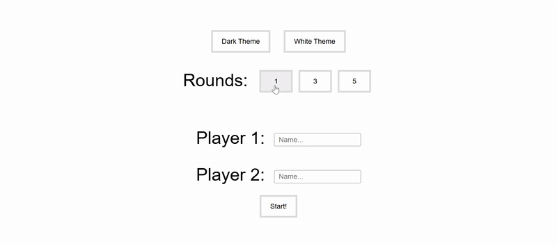

# 🚀 React Tic-Tac-Toe Project
---

## 🎥 Demo

 <!-- Replace this link with your actual GIF URL -->

---

## ⚙️ Tech Stack

  
  
  
  
  

---

## 📦 Available Scripts

In the project directory, you can run:

### `npm start`
Start the app in development mode.  
Opens [http://localhost:3000](http://localhost:3000) in your browser.

### `npm run build`
Builds the app for production to the `build/` folder.  
Optimized for the best performance.

### `npm test`
Launches the test runner in watch mode.

---

## 📚 Learn More

- [React Documentation](https://reactjs.org/)
- [Create React App Guide](https://create-react-app.dev/docs/getting-started/)

---

## 🌐 Deployment

Use platforms like **Vercel**, **Netlify**, or **GitHub Pages** to deploy the `build/` directory.

---

## 👨‍💻 Author

**Chethan Nazre S**  
💼 Full Stack Web Developer  
📘 Researcher @ IRJET: *Predicting the Impact on Re-admission Rates for Hospitalized Diabetic Patients*  
🌐 [GitHub](https://github.com/ChethanNazre) • [LinkedIn](https://www.linkedin.com/in/chethan-nazre-s-85a3b7229/)

---

Made with 💙 using React.
